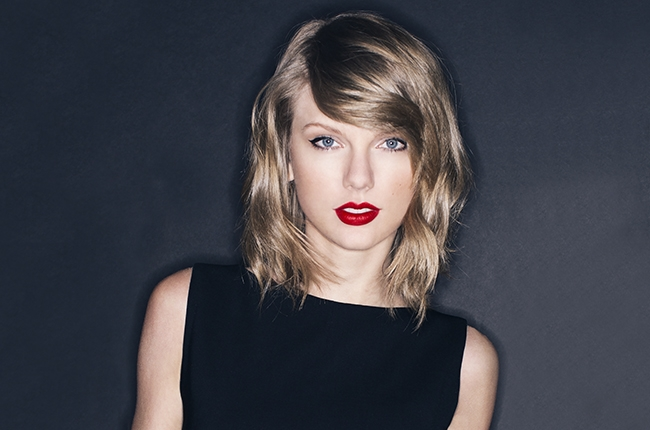
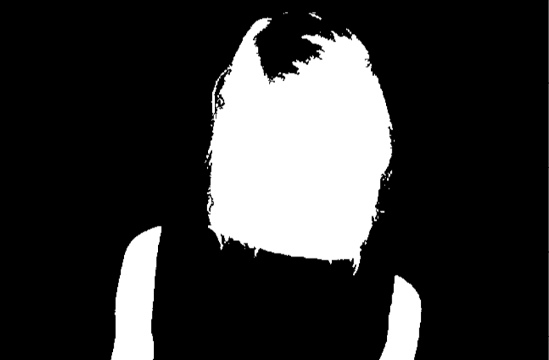
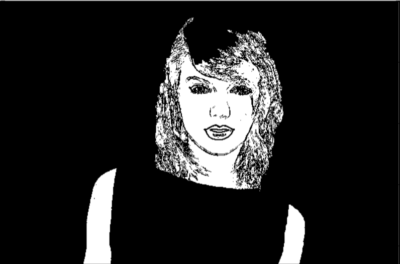
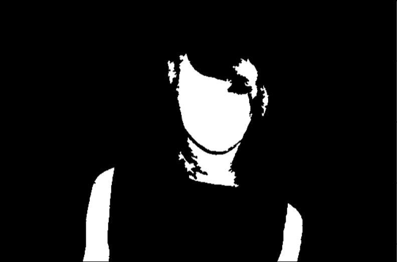
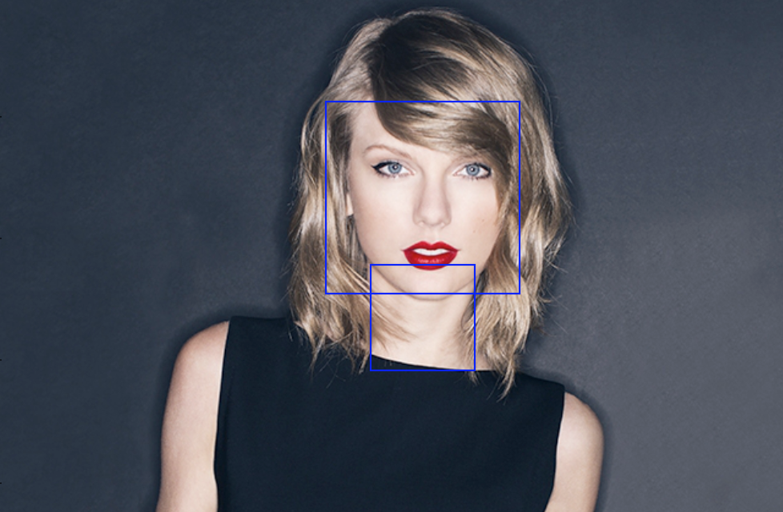
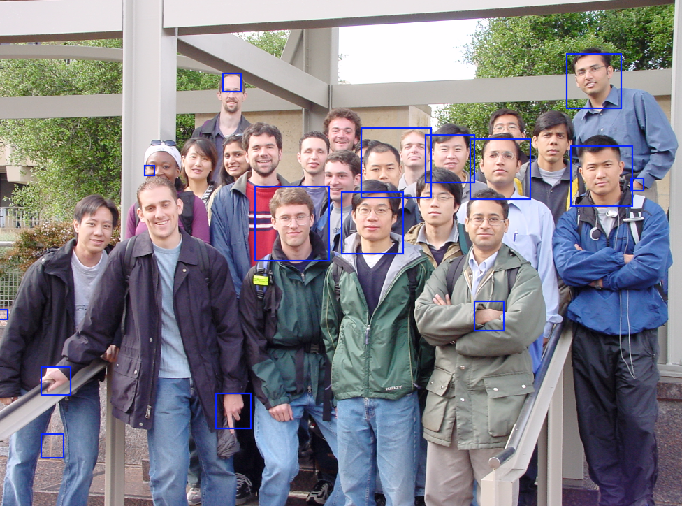

# Face Detection using Image Processing and Neural Networks

This program is my attempt at building a face detection program from scratch,
using some well-known image processing and machine learning techniques. As of
now, the program is broken down into two parts: pre-processing and
classification. Let's walk through this entire process, starting with a rather
well-lit and well-oriented image of Taylor Swift.

The goal of pre-processing is to reduce the size of the search space, by
finding regions in the image that we think could be faces. I first break the
image down into an alternate color spectrum (yCbCr) and ignore the luminance
component. This makes the skin detection procedure invariant to the innate
image brightness and able to account for varying skin tones.

Next, create a binary mask consisting of regions where the Cb and Cr color
intensities fall in the appropriate range. I'm using a pre-defined range for
the time being based on results I've found in various papers, which I plan to
improve in the future. 

Then, run edge detection on the image through convolution with a Canny edge
filter, invert the result and take the logical AND of the two masks.

Finally, perform erosion to remove the small regions, fill in the small holes
and label the connected components in the resulting image.

Once this is all complete, run the results into a binary neural network
classifier and keep only the bounding boxes that registered as faces.

Of course, this example is somewhat contrived since there are many other
factors that we'll encounter in real life. This image is very well-lit and
has some very easily identifiable skin regions. Let's try a much harder image.

As we can see, the results are somewhat poor but we can still see the program
working to some extent. In the future, I aim to add more advanced feature
extraction to the augment the neural network capabilities and to better aid in
training. I also aim to improve the image segmentation portion of the skin
detection procedure and find more high-quality examples for the training set.
In addition, it would be cool to have different kinds of neural networks 
(deep neural nets with many hidden layers, convoluational neural networks
which can learn more advanced features).

# Extra: How to Train Your Neural Network
Neural networks truly are amazing things! Lifting high-dimensional raw data
into a high-level feature space is certainly no small task. However, there
lies a dark side to their seemingly magical abilities. Their ability to
generate a separating hyperplane in incredibly high dimensions can lead to
the deadly curse of overfitting to your training set. Additionally, otherwise
straighforward convex optimization techniques such as gradient decent do not
guarantee any sort of global optimality, since the objective function of
neural networks are generally non-convex. Lastly, what is all this nonsense
about learning rates, regularization parameters and stochastic versus normal
gradient descent? I wouldn't consider myself an expert by any means, but here
are some tips to avoid issues that I came across during my adventures.

1. I've found it really helps to monitor the validation error along with the
training error. Typically, the training and validation error decrease
simultaneously at the beginning but then begin to diverge. Monitoring the
divergence point gives a rough approximation to the start of overfitting.

2. It's also important to adjust the learning rate (if possible) during the
course of training. While a higher learning rate may be useful in the beginning
to kick the neural network out of local minimums, this eventually prevents it
from settling at a good minimum once it's found one. A common technique is to
decay the learning rate at a rate of *c*/(*c* + alpha), where *c* is some
constant that you can specify.

3. Finally, get good training data! I only used a limited set of 400 faces and
300 negative examples, which doesn't give a whole lot of diversity. Faces in a
wide variety of backgrounds would be especially useful, plus you can even apply
image processing techniques to better align the images and/or create more
training data (such as rotating your spaces by a slight amount). Good data is
key to the success of modern face detection/recognition neural networks!
